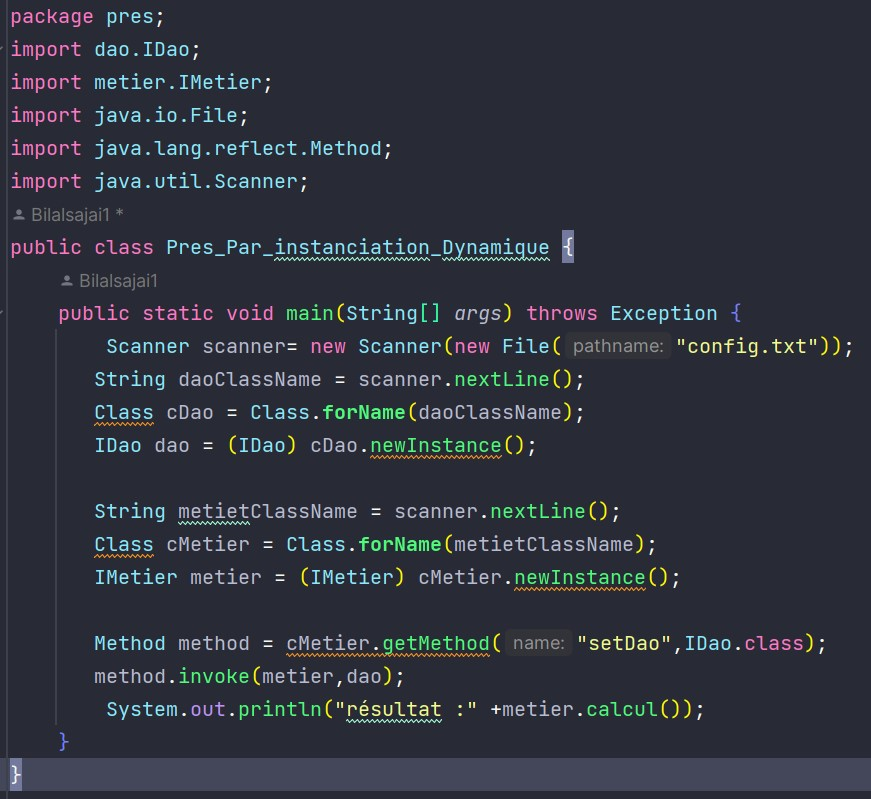

<h1>Inversion de contrôle et Injection
des dépendances</h1>
<h4>1- Creation d'Interface IDao : </h4>

<h4>2- Implimentation de cette Interface  : </h4>

<h4>3- Creation d'Interface IMetier  : </h4>

<h4>4- Implimentation de cette Interface  : </h4>

<h4>5- Injection des dépendaces   : </h4>
<ol type="a">
  <li value="1">Par instanciation statique :</li>
 

  <li>Par instanciation dynamique :</li>
 
    
    avec le fichier config.txt est : 
    
  <li>En utilisant le Framework Spring :
<ul>
<li>Version XML :</li>
 
    
    avec le fichier config.xml est : 
    
<li>Version annotations :</li>
 
    
    en ajoutent bien sure l'annotation  @Repository("dao") sur la class DaoImpl ,
    mème l'annotation  @Service("metier") sur la class MetierImpl
</ul>
</li>
</ol>

